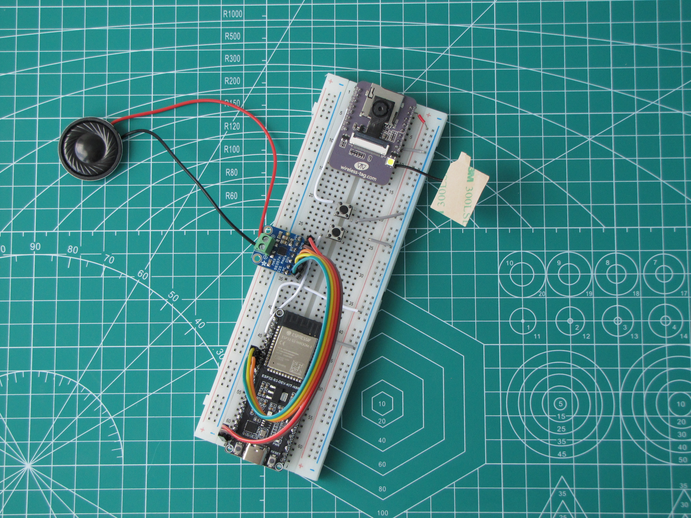
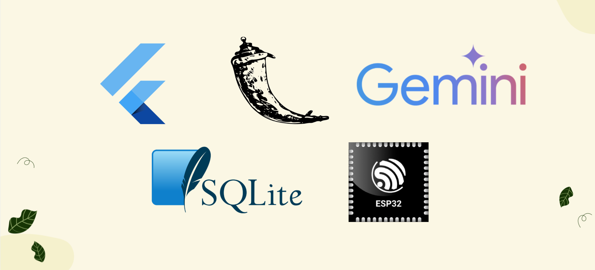

# SafeBite

by SyntaxTERROR

  

## Проблемът и настоящите решения

Много незрящи хора се сблъскват ежедневно с един привидно прост, но всъщност сериозен проблем: не могат да разберат дали храната пред тях е годна за консумация. Развалена ли е? Има ли мухъл? Какво изобщо е това? Въпроси, на които зрящият човек отговаря за секунди — но за незрящия изискват чужда помощ.

Те разчитат на чужда помощ или на ограничени решения като етикети с брайл или мобилни приложения, които обаче не винаги дават точна информация за състоянието на храната (например наличие на мухъл)

## Цел на проекта

Да осигури независимост и сигурност на хората с нарушено зрение при избора на храна, като им предостави бърз, лесен и надежден начин да проверяват нейното състояние без чужда помощ.

## Нашето решение

SafeBite е иновативно асистивно технологично решение, създадено с една цел — да даде на хората с увредено зрение пълна независимост при избора на храна.

## Как работи проектът?

Проектът разполага с ESP32 модул с камера, който позволява на потребителя да вземе снимка на храната си. Тази снимка се изпраща до изкуствен интелект, който определя дали храната е годна за консумация. Отговорът се превръща аудио файл,  който може да бъде чут чрез натискане на бутон

## Използвани технологии

  

